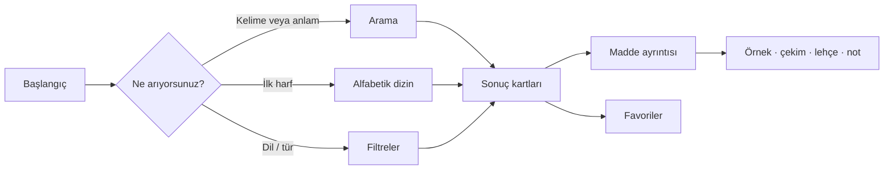
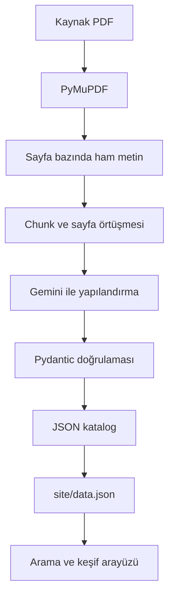

<div align="center">

# Divânu Lügati't-Türk

### 11. yüzyılın söz varlığını arama, karşılaştırma ve keşif için dijital bir katalog

<p>
	
	
	
	
</p>

<p><em>Kaşgarlı Mahmud'un eserindeki kelimeleri, anlamları ve kullanım izleriyle bugünün okuruna yaklaştıran açık bir dijital çalışma.</em></p>

</div>

<br>

> **Sözlüğün izinde.**  Divânu Lügati't-Türk'ün zengin söz varlığını yalnızca saklamak değil, okunabilir ve araştırılabilir bir deneyime dönüştürmek için hazırlanmıştır.

## Proje hakkında

Divânu Lügati't-Türk, Kaşgarlı Mahmud'un 11. yüzyılda kaleme aldığı ve Türk dilleri için temel başvuru kaynaklarından biri kabul edilen eseridir. Bu proje, eserdeki sözlük maddelerini dijital ortamda daha kolay keşfedilebilir hâle getirmeyi amaçlar.

Projenin merkezinde bir PDF dönüştürme aracı değil, **tarihî Türkçe söz varlığını incelemeye açan yaşayan bir dijital katalog** bulunur. Her madde; kelime, anlam, örnek kullanım, çekimler, kelime türü, dil/lehçe bilgisi ve kaynak sayfası gibi alanlarla birlikte ele alınır.

### Rakamlarla katalog

| Gösterge | Değer |
| --- | ---: |
| Dijital sözlük kaydı | **8.129** |
| Kelime türü | **14** |
| Dil / lehçe bilgisi | **107** |
| Sonuç görünümü | 24 kayıt / sayfa |
| Veri biçimi | UTF-8 JSON |

> Sayılar `site/data.json` içindeki mevcut katalog verisinden alınmıştır. Veri genişledikçe bu göstergeler de güncellenmelidir.

## Site deneyimi

Site, tarihî bir sözlüğü yoğun bir veri tablosu gibi değil, sakin ve editoryal bir arşiv gibi kullanıma sunar.



### Öne çıkan özellikler

- **Anlam odaklı arama:** Kelime başında, anlamda, örnek metinde, notlarda, çekimlerde ve lehçe bilgisinde arama yapar.
- **Alfabetik keşif:** Katalogda bulunan harfler üzerinden hızlı gezinme sağlar.
- **Filtreleme:** Kelime türü ile dil/lehçe bilgisine göre sonuçları daraltır.
- **Ayrıntılı madde görünümü:** Bir karta tıklandığında anlam, örnek/kullanım, çekimler, notlar ve dil/lehçe bilgisi birlikte görüntülenir.
- **Favoriler:** İlgi duyulan maddeler tarayıcıdaki `localStorage` alanında saklanır ve daha sonra topluca görüntülenebilir.
- **Sıralama ve sayfalama:** Sonuçlar Türkçe alfabetik sırada listelenir; katalog yoğunluğu sayfalara bölünür.
- **Duyarlı arayüz:** Masaüstü ve mobil ekranlarda çalışacak şekilde tasarlanmıştır.
- **Kaynağa bağlılık:** Maddelerde kaynak sayfası bilgisi korunur; belirsiz kayıtlar `kontrol_gerekli` alanıyla işaretlenebilir.

## Veri katmanları

Proje, farklı kullanım ihtiyaçlarına yönelik iki ayrı veri kümesi içerir. Böylece hızlıca okunabilecek sade bir sözlük listesi ile araştırmaya ve site deneyimine uygun ayrıntılı katalog aynı proje içinde birlikte korunur.

| Veri kümesi | İçerik | Kullanım amacı |
| --- | --- | --- |
| [`datasets/dlt_sozluk_temel.json`](datasets/dlt_sozluk_temel.json) | `kelime` ve `anlam` | Yalnızca kelime ile günümüz Türkçesi karşılığını içeren temel sözlük veritabanı |
| [`datasets/dlt_sozluk_detayli.json`](datasets/dlt_sozluk_detayli.json) | Kelime, anlam, örnek, çekim, tür, lehçe, kaynak sayfası ve notlar | Araştırma, doğrulama ve sitenin ayrıntılı madde görünümü |

### Temel veri kümesi

`dlt_sozluk_temel.json`, sözlük maddelerini en sade biçimde sunar. Her kayıtta tarihî kelime ve onun günümüz Türkçesindeki karşılığı bulunur:

```json
{
	"kelime": "aba",
	"anlam": "baba"
}
```

Bu sürüm; hızlı arama, basit veri aktarımı, kelime listeleri ve farklı uygulamalarda kullanılabilecek yalın bir sözlük tabanı için uygundur. Aynı kelimenin birden fazla anlamı varsa her anlam ayrı bir kayıt olarak tutulabilir.

### Detaylı veri kümesi

`dlt_sozluk_detayli.json`, sitenin kullanıcıya sunduğu zengin katalog yapısının temelidir. Temel kelime ve anlam bilgisinin yanında tarihî maddenin bağlamını koruyan ek alanlar içerir.

## Detaylı veri yapısı

Detaylı katalogdaki her kayıt, araştırmayı ve arayüzdeki ayrıntılı gösterimi destekleyen ortak bir şemaya sahiptir:

```json
{
	"kelime": "aba",
	"anlam": "baba.",
	"ornek_metin": "",
	"cekimler": [],
	"kelime_turu": "isim",
	"dil_veya_lehce": "Tübüt lehçesi",
	"kaynak_sayfa": "129",
	"notlar": "",
	"kontrol_gerekli": false
}
```

Bu yapı sayesinde veri yalnızca sitede gösterilmekle kalmaz; farklı araştırma, karşılaştırma veya görselleştirme çalışmalarına da temel olabilir.

## Hızlı başlangıç

### Siteyi açma

En kolay yöntem Windows'ta [`site/baslat.bat`](site/baslat.bat) dosyasını çalıştırmaktır. Dosya, `site` klasörünü yerel bir sunucu olarak açar ve tarayıcıda `http://localhost:8000` adresine gider.

Komut satırından:

```powershell
cd site
python -m http.server 8000
```

Ardından tarayıcıda [http://localhost:8000](http://localhost:8000) adresini açın.

> `data.json` tarayıcı tarafından `fetch` ile yüklendiği için siteyi doğrudan `index.html` dosyasına çift tıklayarak açmak yerine yerel HTTP sunucusu üzerinden çalıştırmak gerekir.

### Veri üretim hattını çalıştırma

Veri hattı, kaynak PDF'den okunabilir metin çıkarır, metni küçük parçalara ayırır ve yapılandırılmış sözlük kayıtları üretir. Bu bölüm sitenin kullanımından bağımsız olarak, kataloğu güncellemek veya genişletmek isteyen geliştiriciler içindir.

```powershell
pip install -r requirements.txt
```

Kök dizinde `.env` dosyası oluşturun:

```env
GEMINI_API_KEY=API_ANAHTARINIZ
```

Kaynak PDF'yi `data/dlt.pdf` konumuna yerleştirdikten sonra:

```powershell
python main.py
```

Üretim süreci tamamlandığında ara çıktılar `output/` altında tutulur. Site tarafından kullanılan son katalog dosyası `site/data.json` dosyasıdır; yeni veri üretildikten sonra siteye aktarılacak veri bu dosyada bulunmalıdır.

## Klasörlerin rolü

```text
.
├── data/                         Kaynak PDF ve giriş verileri
├── datasets/                     Temel ve detaylı sözlük veri kümeleri
├── output/                      Ara çıktılar ve birleştirilmiş katalog
│   ├── 1_raw_text/               Sayfa bazında ham metin
│   ├── 2_chunks/                 İşleme parçaları
│   └── 3_json/                   Yapılandırılmış parça çıktıları
├── site/                         Kullanıcıya açık dijital sözlük
│   ├── index.html                Sayfa yapısı ve içerik
│   ├── styles.css                Görsel dil ve duyarlı tasarım
│   ├── app.js                    Arama, filtreleme ve etkileşimler
│   └── data.json                 Sitenin okuduğu katalog verisi
├── tam-metin/                    Farklı kaynaklardan derlenen metinler
├── tools/                        Veri düzenleme, temizleme ve karşılaştırma araçları
├── main.py                       Veri üretim hattının giriş noktası
└── requirements.txt              Python bağımlılıkları
```

## Teknik yaklaşım



Teknik hattın amacı, tarihî ve biçimsel olarak karmaşık bir kaynağı doğrudan son kullanıcıya yüklemek değil; kaynağa referansını koruyan, sorgulanabilir ve yeniden kullanılabilir bir veri katmanı oluşturmaktır. İşlem durumu ve ara çıktılar saklandığı için uzun süren çalışmalar kaldığı yerden takip edilebilir.

## Kaynak ve kapsam

- Projenin sözlük odağı: **Divânu Lügati't-Türk**.
- Site arayüzü Türkçe hazırlanmıştır.
- Katalog, tarihî bir kaynağın dijital düzenlemesidir; modern Türkçe sözlük yerine geçmez.
- Anlam, madde sınırı, OCR/metin katmanı veya kaynak eşleştirmesi konusunda şüpheli kayıtlar ayrıca incelenmelidir.
- Veri ve arayüz geliştikçe bu README'deki istatistikler ile `site/data.json` arasındaki uyum korunmalıdır.

## Katkı alanları

Bu çalışma özellikle şu katkılara açıktır:

- Şüpheli veya `kontrol_gerekli` kayıtların kaynakla karşılaştırılması
- Anlam ve örnek metinlerin editoryal olarak gözden geçirilmesi
- Lehçe ve kelime türü sınıflandırmalarının iyileştirilmesi
- Arama deneyiminin ve erişilebilirliğin geliştirilmesi
- Farklı kaynak baskılarının karşılaştırılması
- Katalog verisinin akademik kullanım için belgelenmesi

## Lisans ve kaynak kullanımı

Kaynak eser, veri derleme yöntemi ve kullanılan yayınlar için proje sahibinin belirlediği kaynakça ve kullanım koşulları esas alınmalıdır. Dağıtım veya yeniden kullanım öncesinde kaynak metnin yayın haklarını ve veri setinin güncel lisans durumunu kontrol edin.

<div align="center">

<br>

**Divânu Lügati't-Türk · Kaynağa sadık, aramaya hazır.**

</div>
